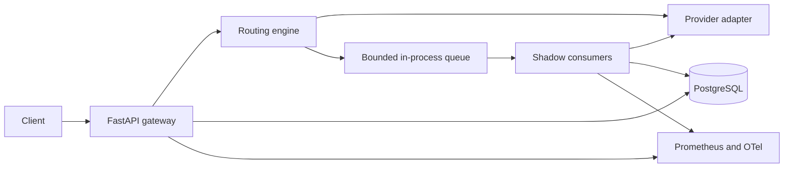

# Architecture

The M3 implementation serves stable/canary requests through an authenticated FastAPI endpoint, a pure router, immutable PostgreSQL configuration snapshots and fake, OpenAI or Groq adapters. Shadow sampling records selection only. The planned full system and its invariants are specified in [the project plan](project-plan.md), sections 6–9.

## Planned flow

The serving request waits only for its selected provider. Shadow work is sampled separately, admitted without waiting for queue capacity, and processed by consumers in the gateway process. A shadow failure must never alter a successful serving response. Restart can lose unfinished in-memory jobs; the evaluation report must show such gaps.

## Module boundaries

| Path | Responsibility |
|---|---|
| `app/api` | Public and administrative HTTP routes |
| `app/core` | Settings, authentication, errors, logging |
| `app/domain` | Routing and evaluation decisions with no I/O |
| `app/providers` | Fake and real provider adapters |
| `app/persistence` | Database models and repositories |
| `app/telemetry` | Metrics and tracing helpers |
| `worker` | Queue admission, consumers, evaluation orchestration |

The current process exposes `/v1/chat/completions`, `/health/live`, `/health/ready` and `/metrics/`. It validates configuration at startup, owns one HTTP client through lifespan, bounds serving slots, and invokes one provider within a total deadline. The request boundary counts actual bytes, generates request IDs and emits allowlisted JSON logs. OpenAI normalization stays inside its adapter; the fake provider needs no network.

PostgreSQL stores releases, configuration versions, the active pointer, activation audit events, request decisions and invocation outcomes. Pointer changes and their audit commit atomically; immutable referenced rows pin in-flight requests. No transaction spans a provider call. A configuration read outage fails before invocation; recording failure preserves a successful provider result with degraded metadata. Readiness depends on the database/configuration, and liveness remains independent.

Production shadow consumers and evaluation remain planned work. M2's isolated queue and trace experiments provide feasibility evidence only. M3's shadow payload is bounded and pins serialized input/releases/configuration, but no queue is started. See [ADR 004](adr/004-persistence-and-routing.md), [the M3 plan](m3-plan.md), and [routing evidence](routing/m3-evidence.json).
