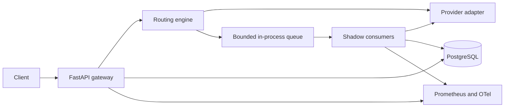

# Architecture

The implementation is currently a foundation scaffold. The planned system and its invariants are specified in [the project plan](project-plan.md), sections 6–9.

## Planned flow

The serving request waits only for its selected provider. Shadow work is sampled separately, admitted without waiting for queue capacity, and processed by consumers in the gateway process. A shadow failure must never alter a successful serving response. Restart can lose unfinished in-memory jobs; the evaluation report must show such gaps.

## Module boundaries

| Path | Responsibility |
|---|---|
| `app/api` | Public and administrative HTTP routes |
| `app/core` | Settings, authentication, errors, logging |
| `app/domain` | Routing and evaluation decisions with no I/O |
| `app/providers` | Fake and real provider adapters |
| `app/persistence` | Database models and repositories |
| `app/telemetry` | Metrics and tracing helpers |
| `worker` | Queue admission, consumers, evaluation orchestration |

The current process exposes only `/health/live` and `/metrics`. The queue, database models, and provider calls are planned work.
