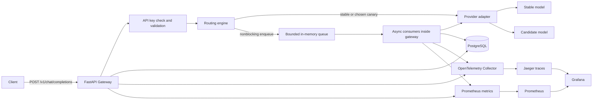
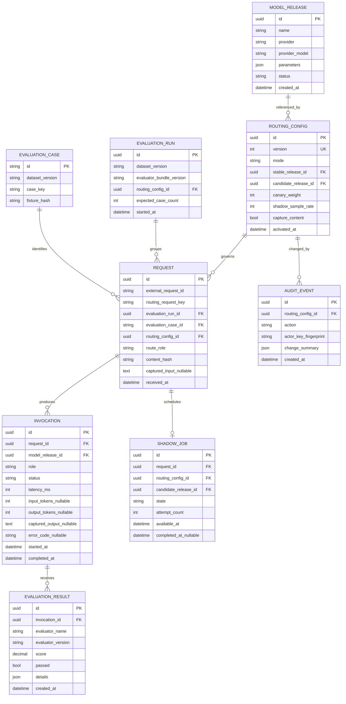
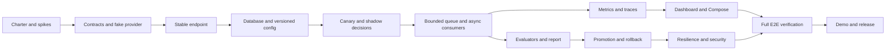
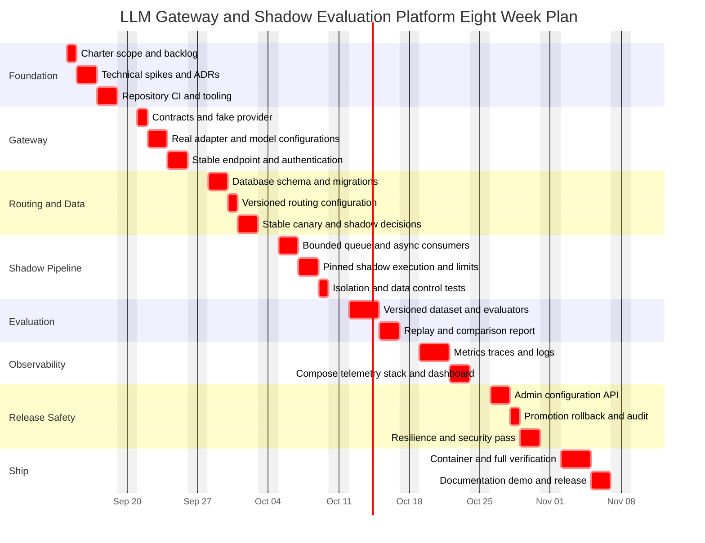

# LLM Gateway and Shadow Evaluation Platform Project Plan

**Project type:** Individual portfolio project  
**Target level:** Level 3 strong portfolio and production-oriented design  
**Deployment boundary:** Local and single-host Docker Compose only; no Kubernetes  
**Baseline schedule:** 8-week intensive track, averaging about 15 hours per week before reserve; 119 planned hours plus 8 hours of reserve  
**Sustainable alternative:** Approximately 11-13 weeks at 10-12 hours per week, including reserve but before additional interruptions  
**Illustrative intensive-track start date:** September 14, 2026  
**Illustrative intensive-track completion date:** November 8, 2026  
**Planning confidence:** Moderate. Re-estimate at the end of Weeks 1, 3, and 6.

## 1. Executive Summary

This project will produce a provider-neutral LLM gateway that exposes one stable chat endpoint while routing requests to configurable stable and candidate models. It will support three routing modes: stable-only, weighted canary, and shadow. In shadow mode, a bounded in-memory queue feeds asynchronous background consumers in the gateway process. They call the candidate and evaluate its result without making the client wait for the candidate. Unfinished background work can be lost on restart; durable processing is an optional extension.

The finished portfolio system will show more than an API wrapper. It will demonstrate model-release safety: deterministic traffic allocation, provider adapters, versioned routing configuration, request and response correlation, evaluation, manual promotion and rollback, metrics, distributed traces, dashboards, failure isolation, tests, and a reproducible Docker Compose environment.

The project is deliberately limited to a credible single-developer scope. It will not include Kubernetes, automatic promotion, multi-region availability, a full web administration interface, enterprise identity, or claims of production readiness. The central demo story is:

> Introduce a candidate model without changing the client, shadow representative requests, compare reliability, latency, token usage, and task quality, move the candidate to a 10% canary, and either promote it manually or roll it back.

## 2. Purpose of the Project

### 2.1 Problem statement

Applications that call an LLM provider directly make model changes risky and hard to measure. A new provider or model can improve cost or quality while silently degrading JSON compliance, latency, error rate, token consumption, or task behavior. HTTP success alone does not establish that an LLM response is useful.

The project exists to demonstrate a small but complete control layer between a client and multiple LLM backends. It makes model changes observable, comparable, and reversible while keeping the client-facing contract stable.

### 2.2 Intended audience

- The primary user is the project author, acting as an application developer or platform engineer.
- The portfolio audience is a recruiter, interviewer, engineering manager, or peer reviewer.
- The demonstration client is a script or API consumer, not a full end-user application.

### 2.3 Portfolio value

The project should provide evidence of the following capabilities:

- Designing a clean HTTP API and provider abstraction.
- Applying asynchronous I/O, bounded background work, and explicit failure isolation.
- Implementing deterministic weighted rollout and non-blocking shadow evaluation.
- Treating LLM quality, latency, reliability, and usage as separate measurable dimensions.
- Working with PostgreSQL migrations, telemetry, Prometheus, Grafana, and Docker Compose.
- Testing success paths, degraded dependencies, routing statistics, and privacy controls.
- Explaining trade-offs, limitations, and future production work honestly.

### 2.4 Planning approach derived from the requested article

The Sloth Bytes article recommends starting small, breaking unknown work into manageable tasks, iterating after basic functionality works, prioritizing progress over perfection, completing important features first, and adding a distinctive twist. This plan applies that guidance as follows:

- **Start small:** Build an in-memory fake provider and one stable endpoint before using paid external APIs.
- **Reduce unknowns:** Create short technical spikes for provider normalization, cancellation/timeouts, and telemetry before committing to deeper implementation.
- **Iterate in vertical slices:** Each week must end with a runnable path, not a collection of disconnected layers.
- **Finish core features first:** Stable, canary, shadow, persistence, evaluation, and observability take priority over a UI or extra providers.
- **Use a unique twist:** The differentiator is a replayable model-release report joining system metrics with task-quality evidence.
- **Avoid broken windows:** A shortcut must be fixed immediately, converted to an explicit tracked issue with a safe fallback, or removed from the supported path.

Source: [How to Start a Programming Project: From Idea to First Version](https://www.slothbytes.dev/p/programming-projects).

## 3. Goals and SMART Objectives

### 3.1 Project goal

Build and publicly demonstrate a reproducible Level 3 LLM gateway that lets a client safely compare and gradually adopt a candidate model without changing its endpoint or exposing shadow responses to users. Target eight intensive weeks, or approximately 11-13 weeks at 10-12 hours per week. The weekly objectives below follow the intensive track; rebase their dates together when using the sustainable track.

### 3.2 SMART objectives

| ID | Objective | Measure and target | Deadline | Evidence |
|---|---|---|---|---|
| O1 | Deliver a stable provider-neutral API. | `POST /v1/chat/completions` accepts the documented request shape and returns a normalized response through at least two interchangeable adapters, including a deterministic fake adapter. | End of Week 2 | Contract tests and demo request |
| O2 | Implement three correct routing modes. | Stable-only, deterministic weighted canary from 0-100%, and sampled shadow routing pass functional tests; the same request key always receives the same canary decision for one configuration version. | End of Week 3 | Unit/property tests and routing distribution report |
| O3 | Isolate shadow work from user latency. | Candidate responses never reach the client; full queues and candidate failures leave the stable response intact; all accepted jobs reach a terminal state in a healthy, uninterrupted fake-provider test. Restart losses are reported separately. | End of Week 4 | Queue-saturation, timeout, shutdown, and restart tests |
| O4 | Capture comparable release evidence. | For every completed stable/candidate pair, store correlation IDs, model/config versions, status, latency, token usage when supplied, and evaluator results. | End of Week 5 | Database query and release report |
| O5 | Make behavior observable. | A provisioned dashboard shows request rate, stable/candidate traffic, p50/p95 latency, errors, shadow backlog, token use, and evaluation score; a trace correlates gateway and provider calls. | End of Week 6 | Dashboard screenshot and trace walkthrough |
| O6 | Support reversible model changes. | Authenticated manual promote and rollback operations create immutable configuration versions and take effect without client changes; rollback completes within 60 seconds in the demo. | End of Week 7 | Audit record and scripted demo |
| O7 | Reach portfolio quality. | Core tests pass, the stack starts from a clean checkout using documented commands, no secret is committed, and a reviewer can complete the quickstart in 15 minutes. | End of Week 8 | CI, secret scan, clean-machine rehearsal, README |

## 4. Scope

### 4.1 In scope

#### Gateway and routing

- One versioned client-facing chat endpoint with a deliberately small normalized schema.
- Request ID generation and an optional routing request key. A repeated routing key does not promise response deduplication or prevent another paid provider call.
- Provider adapter interface plus:
  - deterministic fake provider for tests and offline demos;
  - two real model configurations, which may use one or two vendors;
  - provider responses normalized to the gateway response model.
- Stable-only routing.
- Deterministic weighted canary routing.
- Independently sampled shadow routing.
- Per-provider timeout, bounded retries for safe transient failures, and normalized errors.

#### Shadow evaluation and storage

- A bounded `asyncio.Queue` and a fixed number of background consumers managed by application startup/shutdown; one gateway process in the core deployment.
- Explicit skipped, failed, expired, and interrupted outcomes. Redis/Celery and recovery of unfinished jobs are optional post-release work.
- Storage of request metadata, invocations, routing decisions, evaluation results, and configuration history in PostgreSQL.
- Configurable content capture: off by default for general use; explicitly enabled for the synthetic demo dataset.
- A pluggable evaluator interface with deterministic, task-aware evaluators.
- A release comparison endpoint or CLI report that aggregates stable versus candidate evidence.

#### Operations and observability

- Structured JSON logs with correlation IDs and no secrets.
- OpenTelemetry traces for gateway, routing, queue, worker, database, and outbound provider calls.
- Prometheus metrics designed with bounded label cardinality.
- Grafana dashboards provisioned from version-controlled files.
- Health and readiness endpoints.
- Dockerfiles and a Docker Compose stack for gateway, PostgreSQL, OpenTelemetry Collector, Prometheus, Jaeger, and Grafana. Background consumers run inside the gateway container.

#### Delivery quality

- Database migrations.
- Unit, contract, integration, end-to-end, fault, and small load tests.
- CI for linting, types, tests, dependency review, and secret scanning.
- Architecture decision records, operating notes, demo script, screenshots, and a concise project retrospective.

### 4.2 Explicitly out of scope

- Kubernetes, Gateway API, service mesh, Helm, and Argo Rollouts.
- Multiple gateway replicas, leader election, multi-region or high-availability guarantees.
- Redis/Celery, a separate worker service, durable job recovery, and per-key rate limiting in the core release. These are optional extensions; bounded requests, queues, and concurrency remain mandatory.
- Automatic promotion or rollback. The system calculates evidence; a human changes release state.
- Enterprise RBAC, OAuth/OIDC, SSO, tenant isolation, billing, or chargeback.
- A polished administration web UI. OpenAPI, a CLI/script, and Grafana are sufficient.
- Streaming responses in the core release. It complicates shadow timing, cancellation, and normalized contracts.
- Tool calls, multimodal input, embeddings, RAG, prompt management, semantic caching, or model-selection ML.
- Training or hosting an LLM, GPU infrastructure, or fine-tuning.
- A general-purpose evaluation framework or claims that automated scores prove factual correctness.
- Storing real sensitive or production traffic.
- Formal SLA, compliance, penetration testing, disaster recovery, or production certification.

### 4.3 Scope-control rule

A new idea enters the core scope only if it is required by an acceptance criterion, removes a blocker, or replaces an existing task with equal or lower effort. All other ideas go to the stretch-goal backlog. The selected track's deadline does not move to accommodate optional work.

## 5. Assumptions and Constraints

### 5.1 Assumptions

- The author has basic Python, HTTP, Git, SQL, and Docker knowledge.
- The eight-week intensive track averages about 15 focused hours per week, or about 16 with reserve. Individual weekly allocations vary. If only 10-12 hours are available, use the 11-13-week sustainable alternative before additional interruptions.
- The development machine can run six modest containers; observability can use a separate Compose profile during development.
- At least one real LLM provider credential is available by Week 2; a fake provider keeps all development and CI independent of credentials.
- Demo prompts are synthetic, public, or created specifically for the project.
- Provider APIs may differ or change; all provider-specific behavior remains behind adapters.
- The illustrative schedule starts September 14, 2026. If the actual start differs, preserve task order and shift dates.

### 5.2 Constraints

- One developer owns architecture, implementation, testing, operations, and documentation.
- External API calls have cost and rate limits.
- LLM output is nondeterministic, so exact text equality is unsuitable for most evaluations.
- Token counts and finish reasons may not be consistently available across providers.
- Shadow requests can double provider traffic for sampled requests.
- The project is a portfolio system, so design clarity and reproducibility matter more than extreme scale.

### 5.3 Working budget

| Item | Budget or limit |
|---|---|
| Developer time | 119 planned hours; hold up to 8 additional hours as management reserve and cut optional work before spending it |
| Provider spend | Set a personal cap, recommended USD 25-50 total; enforce low output-token limits during development |
| Shadow sample | 10% default during normal development; 100% only for bounded evaluation runs |
| Stored demo data | Approximately 100-500 synthetic requests |
| Retention | 30 days by default, with a purge command |

## 6. Success Criteria and Guardrails

The project is successful when a reviewer can start the stack, send a request to one endpoint, see which release served it, run a shadow comparison, inspect the resulting record and trace, move the candidate into a small canary, and demonstrate promotion or rollback.

The project is not successful merely because all containers run. The release evidence must be correct, understandable, and linked by stable identifiers.

Core invariants:

1. Shadow output is never returned to the client.
2. A shadow failure cannot turn a successful stable request into a client error.
3. Canary selection is deterministic for a request key and configuration version.
4. Every routing decision records the exact configuration version used.
5. Promotion never overwrites history; it creates a new immutable configuration version.
6. Raw prompts and outputs never appear in logs or metric labels.
7. Retries are bounded and observable.
8. The fake provider can exercise every routing and failure path without network access.
9. A full shadow queue never blocks the serving path; the skipped copy is counted.
10. Every job retains its original release IDs, configuration version, request parameters, and evaluation identifiers, even after promotion or rollback.
11. Recording failures after a successful provider call do not turn that response into a client error. Administrative changes must persist before activation.

## 7. Proposed Architecture



### 7.1 Component responsibilities

| Component | Responsibility | Must not do |
|---|---|---|
| Gateway | Validate requests, authenticate, load active config, route, call the serving model, persist metadata, enqueue shadow work, return normalized response. | Wait for shadow completion or expose raw provider credentials. |
| Routing engine | Produce a deterministic serving and shadow decision from config and request key. | Call providers or mutate configuration. |
| Provider adapter | Translate normalized request/response shapes and normalize errors, usage, and finish reason. | Decide release policy. |
| Background consumers | Consume shadow jobs, invoke the pinned candidate, persist outcomes, run evaluators, and handle bounded retries. | Affect the serving response or create unbounded tasks. |
| PostgreSQL | Store durable configuration, request/invocation metadata, evaluation results, and audit events. | Store secrets. |
| In-memory queue | Buffer at most the configured number of bounded payloads. | Block serving requests or promise durability across restarts. |
| Telemetry stack | Collect, store, and display bounded operational signals. | Store prompt or response bodies in labels/spans. |

### 7.2 Request flows

#### Stable-only

1. Authenticate and validate the request.
2. Resolve the active configuration version.
3. Record a stable routing decision.
4. Invoke the stable adapter with a timeout.
5. Persist metadata and return the normalized stable response.

#### Canary

1. Hash `configuration_version + request_key` into a bucket from 0 to 9,999.
2. Choose candidate when the bucket is below `candidate_weight * 100`; otherwise choose stable.
3. Invoke only the selected serving model.
4. Return that result and label it with release role and configuration version.

This avoids surprising route changes across retries while producing an approximately correct aggregate split. A synthetic distribution test over at least 10,000 unique keys must be within +/-1.5 percentage points of the configured weight.

#### Shadow

1. Snapshot the active configuration, stable/candidate release IDs, normalized parameters, and evaluation run/case identifiers. Decide shadow sampling independently of the stable result.
2. Call the stable model. For a known evaluation case, compute its lightweight deterministic scores before discarding its output when content capture is off.
3. Attempt bounded metadata recording. Recording failure is counted and logged safely; it does not invalidate a successful serving response.
4. Submit the pinned request, serving outcome/scores, identifiers, and trace context with `put_nowait`. If full, record `skipped_queue_full` and continue immediately. A stable provider error can still yield a shadow job, but that request is not a completed quality pair.
5. Return the serving result without awaiting candidate execution or queue space. Consumers process accepted jobs independently and record their terminal outcome.

Initial configurable limits: 100 queued jobs, two shadow consumers, 64 KiB normalized input per request, a bounded captured output, a 30-second total shadow execution deadline including at most one retry, and a 60-second maximum queue age. Expired jobs are skipped without a provider call. Use separate serving and shadow concurrency limits so shadow traffic cannot occupy every serving slot. Tune these defaults with the fake-provider load test.

Measure serving response time, provider attempt duration, queue wait, and total shadow completion time separately. Candidate provider latency excludes queue wait and retry backoff; retry counts and total completion time remain visible. Claim independence from candidate latency, not zero scheduling or metadata overhead. Verify less than 50 ms additional p95 serving overhead in the documented local fake-provider benchmark.

Consumers are supervised lifespan tasks, not one detached task per request. On graceful shutdown, stop accepting shadow copies, allow up to 10 seconds to drain, then cancel remaining work. On process crash, queued/in-flight work is lost. Mark known pending records interrupted on restart and show missing outcomes in evaluation runs; do not silently replay paid calls.

### 7.3 Architecture decisions

- **Modular monolith with background consumers:** One gateway process owns the queue and consumer lifecycle. Separate modules keep serving, routing, and evaluation testable.
- **Bounded in-memory queue first:** Use explicit capacity and nonblocking admission, as supported by [Python asynchronous queues](https://docs.python.org/3/library/asyncio-queue.html). Losing unfinished work on restart is a documented portfolio limitation. Durable processing is optional and must not delay the core demo.
- **Direct Prometheus application metrics plus OpenTelemetry traces:** This keeps the first dashboard simple while still demonstrating trace context. Do not duplicate the same metric through two pipelines in the MVP.
- **Jaeger for trace storage:** It is straightforward for a local demo. Grafana may link to it; a fully unified LGTM stack is unnecessary.
- **Configuration in PostgreSQL:** Immutable versions and audit history are easier to demonstrate than editing a live YAML file. A seed command creates the first config.

## 8. Technology Choices

| Area | Choice | Reason | Alternative considered |
|---|---|---|---|
| Language | Python 3.12 | Strong async and data tooling; accessible portfolio code. | Go would improve static guarantees but add learning time. |
| API | FastAPI and Uvicorn | Typed contracts, OpenAPI, dependency injection, async endpoints. | Flask requires more assembly. |
| Validation/config | Pydantic 2 and pydantic-settings | Shared request and configuration models. | Hand validation is unnecessary risk. |
| Outbound HTTP | HTTPX async client | Connection pooling, timeouts, test transports, OTel support. | Provider SDKs can be wrapped later. |
| Persistence | PostgreSQL 16+ | Relational joins suit request, invocation, release, and evaluation history. | SQLite is simpler but weaker for concurrent worker behavior. |
| ORM/migrations | SQLAlchemy 2 async and Alembic | Explicit models and repeatable schema evolution. | Raw SQL is acceptable for hotspots, not the default. |
| Queue | Bounded `asyncio.Queue` with lifespan consumers | Small dependency footprint, explicit capacity, and controlled async execution. | Redis/Celery adds durable processing later. |
| Metrics | Prometheus Python client | Standard counters, gauges, and histograms. | OTel-only metrics add collector complexity to the MVP. |
| Tracing | OpenTelemetry Python and OTLP Collector | Vendor-neutral trace generation and context propagation. | Provider-specific tracing reduces portability. |
| Dashboards | Grafana | Provisionable, familiar, and works with Prometheus/Jaeger. | Custom UI is out of scope. |
| Testing | pytest, pytest-asyncio, HTTPX test client, Testcontainers or Compose test profile | Supports fast units and real integration boundaries. | Mock-only testing would miss database and queue behavior. |
| Quality | Ruff, mypy, pre-commit | Fast feedback and consistent code. | Multiple overlapping formatters add little value. |
| Packaging | `pyproject.toml` plus locked dependencies | Reproducible local and CI setup. | Unpinned `requirements.txt` is less controlled. |
| Delivery | Docker Compose | Reproducible single-host Level 3 environment. | Kubernetes is intentionally deferred. |

Pin versions when implementation begins, use supported releases, and record major upgrades in an ADR. Do not copy “latest” version numbers into architecture assumptions without checking official release notes.

## 9. Repository Structure

```text
llm-gateway/
├── app/
│   ├── api/                 # public and admin routes
│   ├── core/                # settings, auth, errors, logging
│   ├── domain/              # routing and evaluation rules
│   ├── providers/           # interface, fake, provider adapters
│   ├── persistence/         # ORM models and repositories
│   ├── telemetry/           # metrics and tracing helpers
│   └── main.py
├── worker/                  # in-process queue, consumer lifecycle, evaluation orchestration
├── migrations/              # Alembic revisions
├── tests/
│   ├── unit/
│   ├── contract/
│   ├── integration/
│   ├── e2e/
│   └── fixtures/
├── observability/
│   ├── prometheus/
│   ├── grafana/
│   ├── otel-collector/
│   └── jaeger/
├── scripts/                 # seed, demo, report, purge
├── docs/
│   ├── adr/
│   ├── architecture.md
│   ├── evaluation.md
│   ├── operations.md
│   └── demo.md
├── compose.yaml
├── Dockerfile
├── pyproject.toml
├── .env.example
└── README.md
```

## 10. Data Model



### 10.1 Data rules

- Store UTC timestamps.
- Use UUIDs internally and accept a bounded client request ID for correlation.
- Store a salted content hash even when content capture is disabled so duplicate demo inputs can be identified without metric-label exposure.
- Store raw content only when `capture_content=true` and the dataset is approved for the demo.
- The in-memory queue holds the normalized request until it is consumed. Use synthetic/non-sensitive data and discard transient payloads after completion, expiry, or cancellation. `capture_content=false` controls persistent content storage; it cannot eliminate transient input needed to call a model.
- When capture is off, compute stable scores in memory and pass those scores with the job. Compute candidate scores before discarding candidate output. Persist scores and safe reason codes only; evaluator details must not reproduce raw output. Skip content-level disagreement previews when bodies were not retained.
- Register immutable dataset/case versions from version-controlled synthetic fixtures. Case IDs identify a dataset version plus case key. Evaluation requests have both a run ID and case ID; ordinary traffic may leave them null. Store expected run cases so missing results remain visible after recording failure or restart.
- `SHADOW_JOB` records are metadata, not a durable queue or automatic replay instruction. Enforce at most one logical final invocation per request/release/role; track retries separately. This prevents duplicate result rows, not duplicate external billing.
- Never store provider API keys, authorization headers, or complete exception dumps containing request bodies.
- Add indexes on request time, configuration version, release/role/status, and incomplete shadow jobs.
- Evaluation results are append-only and include evaluator version so scores remain reproducible.
- Implement `scripts/purge_data` for records older than the configured retention period.

## 11. API Plan

### 11.1 Public endpoints

| Method and path | Purpose | Authentication | Core response |
|---|---|---|---|
| `POST /v1/chat/completions` | Submit a normalized chat request. | Client API key | Normalized completion, request ID, serving role, release name, config version, usage if known |
| `GET /health/live` | Confirm the process event loop is alive. | None | `200` without dependency checks |
| `GET /health/ready` | Confirm required serving dependencies are usable. | None/local only | `200` or `503` with bounded checks |
| `GET /metrics` | Prometheus scrape endpoint. | Network-scoped in Compose | Prometheus exposition |

Minimum request shape:

```json
{
  "messages": [
    {"role": "system", "content": "Return valid JSON."},
    {"role": "user", "content": "Classify: I was charged twice."}
  ],
  "task_type": "support_classification",
  "request_key": "demo-case-0042",
  "max_output_tokens": 200,
  "temperature": 0
}
```

### 11.2 Administrative endpoints

| Method and path | Purpose | Required behavior |
|---|---|---|
| `GET /admin/releases` | List model releases. | Redact credentials and provider secrets. |
| `POST /admin/releases` | Register a release. | Validate adapter, model identifier, and safe parameter bounds. |
| `GET /admin/configs` | Show immutable configuration history. | Include active version. |
| `POST /admin/configs` | Create and activate a routing version. | Validate weights 0-100 and required candidate. |
| `POST /admin/promotions` | Promote current candidate. | Transactionally create a new stable config and audit event. |
| `POST /admin/rollbacks` | Reactivate a prior stable release through a new config version. | Never delete or mutate the old record. |
| `GET /admin/reports/{config_version}` | Aggregate comparison evidence. | Include sample size and missing-data counts. |
| `GET /admin/requests/{request_id}` | Inspect one correlated flow. | Return content only if capture was enabled and caller is admin. |

Enable a 10% canary through `POST /admin/configs` with `mode=canary` and `canary_weight=10`. Promotion is a separate operation: candidate becomes stable, mode becomes stable-only, candidate is cleared, and canary/shadow percentages become zero. Rollback creates a new stable-only configuration pointing to the selected earlier stable release. Persist the configuration and audit event before atomically switching the active version; a database failure leaves the prior version active.

Queued jobs and in-flight calls keep their pinned release/configuration snapshot. Model-release definitions are immutable; registering changed parameters creates a new release. Activation affects new requests only. Evaluation runs pin one configuration throughout the replay. `request_key` controls deterministic routing within a version and is not an exactly-once request guarantee. The endpoint uses a project-specific schema despite its familiar path; full provider SDK compatibility is not a core claim.

### 11.3 Error contract

All errors use one shape with `error.code`, safe `error.message`, `request_id`, and optional retry guidance. Map provider errors into a small controlled vocabulary such as `provider_timeout`, `provider_rate_limited`, `provider_authentication`, `provider_unavailable`, and `invalid_provider_response`. Do not forward provider stack traces or raw bodies to clients.

## 12. Evaluation Strategy

### 12.1 Evaluation question

For a fixed synthetic workload, does the candidate meet the task contract without an unacceptable regression in reliability, latency, or usage compared with the stable release?

### 12.2 Core evaluation dataset

Create 50-100 version-controlled synthetic cases for one narrow task, recommended: customer-support classification into a known JSON schema. Each case contains input messages, expected category, required JSON schema, and optional expected keywords. This makes quality measurable without pretending that a generic judge establishes truth.

Each replay creates a new `evaluation_run_id` and records the dataset version, case IDs, configuration version, evaluator version, and generation parameters. Compare the same case and parameters across stable/candidate, apart from declared release differences. Unknown cases can receive generic format checks, but classification accuracy must be marked unavailable without a trusted expected label. Never silently treat an unavailable evaluator as a passing result.

### 12.3 Evaluator interface

Each evaluator receives the task case, normalized response, and release metadata. It returns `score` from 0 to 1, `passed`, details, name, and version.

Core evaluators:

| Evaluator | Weight | Method |
|---|---:|---|
| Invocation success | Gate | Provider call completed with a parseable normalized response. |
| JSON/schema compliance | 0.30 | Parse output and validate required fields/types/enums. |
| Classification correctness | 0.50 | Compare normalized category with the synthetic expected label. |
| Constraint compliance | 0.20 | Check output length and forbidden/required fields. |

`quality_score = 0.30 * schema + 0.50 * correctness + 0.20 * constraints`, but invocation failure produces a failed result and is reported separately rather than disguised as a low semantic score.

### 12.4 Comparison report

For stable and candidate, report:

- Number accepted, completed, failed, timed out, and missing.
- Success rate with sample size.
- Quality pass rate and mean quality score.
- p50 and p95 latency.
- Mean input/output tokens when available, plus unavailable count.
- Candidate minus stable deltas.
- Paired win/tie/loss counts for requests with both completed outputs.
- Five representative disagreements for manual review.
- Run ID, dataset/evaluator versions, selected/skipped/expired/interrupted counts, and expected versus recorded cases. Content previews require capture to have been enabled; otherwise show case IDs and score disagreements.

Do not claim statistical significance in the MVP. State that small sample sizes are directional evidence. A stretch goal may add confidence intervals or bootstrap analysis.

### 12.5 Suggested manual decision policy

A candidate is eligible for manual promotion in the scripted demo when:

- At least 50 paired evaluations completed.
- Candidate invocation success is no more than 2 percentage points below stable.
- Candidate schema pass rate is at least 98%.
- Candidate mean task quality is no more than 0.03 below stable.
- Candidate p95 latency is no more than 20% worse unless quality improves by at least 0.05.
- A human reviews at least five disagreements and records the decision.

These are demonstration thresholds, not universal production standards.

## 13. Observability Plan

OpenTelemetry provides standard APIs/SDKs for generating telemetry, and its Python documentation distinguishes stable traces and metrics from still-developing logs. Use OpenTelemetry for traces and Python structured logging for logs in this scope. See [OpenTelemetry Python](https://opentelemetry.io/docs/languages/python/) and [manual instrumentation](https://opentelemetry.io/docs/languages/python/instrumentation/).

### 13.1 Metrics

| Metric | Type | Labels | Purpose |
|---|---|---|---|
| `gateway_requests_total` | Counter | route, release_role, status | Traffic and error rates |
| `gateway_request_duration_seconds` | Histogram | route, release_role | Client-visible latency |
| `provider_invocations_total` | Counter | provider, release, role, status | Provider reliability |
| `provider_duration_seconds` | Histogram | provider, release, role | Stable/candidate latency |
| `provider_input_tokens_total` | Counter | provider, release, role | Input usage when available |
| `provider_output_tokens_total` | Counter | provider, release, role | Output usage when available |
| `shadow_jobs_total` | Counter | state | Accepted/completed/retried/dead jobs |
| `shadow_queue_depth` | Gauge | queue | Backlog health |
| `shadow_queue_wait_seconds` | Histogram | queue | Time before candidate execution |
| `shadow_completion_duration_seconds` | Histogram | status | End-to-end shadow time including waits and retries |
| `recording_failures_total` | Counter | stage | Metadata/evaluation write failures |
| `evaluation_results_total` | Counter | release, evaluator, passed | Quality compliance |
| `routing_decisions_total` | Counter | config_version, selected_role | Actual traffic allocation |

Never use request ID, user ID, raw model output, prompt, or error text as a label. Prometheus recommends counters, gauges, and histograms for these common cases and stresses thoughtful instrumentation and labels; see [Instrumentation](https://prometheus.io/docs/practices/instrumentation/) and [client libraries](https://prometheus.io/docs/instrumenting/clientlibs/).

### 13.2 Traces

Create spans for HTTP ingress, routing decision, database operations, queue publish/consume, provider calls, and evaluator execution. Propagate `traceparent` into the job payload. Add bounded attributes: request ID hash, configuration version, provider, release role, model release, routing mode, retry number, status, token counts, and evaluator name. Do not put prompts or responses in spans.

The OpenTelemetry semantic conventions provide shared attribute naming, but Generative AI conventions may be experimental or move between repositories. Wrap GenAI-specific attribute names in one module and pin the semantic-conventions package so upgrades are deliberate. See [OpenTelemetry semantic conventions](https://opentelemetry.io/docs/specs/semconv/).

### 13.3 Logs

Emit one-line JSON with timestamp, level, service, event name, request ID, trace/span IDs, configuration version, role, release, duration, safe error code, and retry count. Central log aggregation is out of scope; `docker compose logs` must be enough for the demo.

### 13.4 Grafana dashboard

Provision one dashboard from source control with panels for:

1. Request rate and error percentage.
2. Actual stable/candidate split versus configured canary weight.
3. Stable and candidate p50/p95 provider latency.
4. Token input/output rates.
5. Shadow accepted/completed/failed/retried/skipped/expired totals, queue depth, queue wait, and completion time.
6. Evaluation pass rate by release/evaluator.
7. Active configuration version.
8. Links or instructions for opening a correlated trace.

Grafana supports file-based provisioning for version-controlled data sources and dashboards; see [Provision Grafana](https://grafana.com/docs/grafana/latest/administration/provisioning/).

## 14. Security and Failure Handling

### 14.1 Security baseline

- Require separate client and admin API keys; compare securely and store only hashes/fingerprints in application records.
- Load secrets from environment variables or local secret files excluded by Git. Commit only `.env.example`.
- Validate body size, message count, roles, token limit, temperature, task type, weights, and provider/model allowlists.
- Bound request size, output-token limits, serving concurrency, shadow concurrency, and queue capacity in the core release. Per-key request-rate limiting is optional post-release work.
- Restrict admin endpoints and metrics to the Compose/private network where practical.
- Disable raw content capture by default and redact authorization headers everywhere.
- Pin dependencies, run a vulnerability audit, and enable a secret scanner in CI.
- Use non-root containers, read-only filesystem where practical, health checks, and explicit published ports.
- Document that local HTTP is for demonstration; TLS termination is required before any remote deployment.
- Review the design against authentication, authorization, resource consumption, misconfiguration, inventory, and unsafe upstream-consumption risks in the [OWASP API Security Top 10](https://owasp.org/API-Security/).

### 14.2 Failure policy

| Failure | Client behavior | Internal behavior | Verification |
|---|---|---|---|
| Stable provider timeout | Return normalized `504`/gateway timeout. | Record timeout metric/span; retry only if policy marks request safe and within total deadline. | Fault test |
| Candidate canary timeout | Return normalized error because candidate was the serving release. | Record role clearly; manual rollback remains available. | E2E test |
| Shadow candidate timeout | Stable response remains unchanged. | At most one retry for an eligible transient failure within the total shadow deadline, then a terminal failure. | Integration test |
| Shadow queue full or consumer unavailable | Stable response proceeds. | Skip the copy with a bounded reason code and counter; never wait for capacity. | Saturation/fault test |
| PostgreSQL unavailable before serving | Return `503` if active configuration cannot be resolved safely. | Readiness fails. Optional short-lived cached config may be a stretch goal. | Fault test |
| PostgreSQL write fails after provider result | Return the successful serving response, with an additive `recording_status=degraded` field where detected. | Increment failure counter and log safe identifiers; mark report gaps against expected run cases. Do not retry the provider call to repair metadata. | Fault test |
| Configuration or promotion write fails | Return normalized `503`; preserve the previously active configuration. | No activation until configuration and audit transaction commits. | Transaction failure test |
| Provider `429` | Return normalized `429` for serving call. | Respect `Retry-After`; bounded retry in shadow worker only. | Adapter contract test |
| Malformed provider response | Return normalized `502`. | Store safe parse error code, not raw sensitive body. | Contract test |
| Background consumer task fails | No change to a serving result. | Supervise/restart the consumer; record its current job as failed where possible. | Consumer fault test |
| Gateway process crashes | Already delivered responses remain valid; active client calls may fail. | In-memory jobs are lost. Mark known pending records interrupted on restart and report other missing run cases. No automatic paid replay. | Process restart test |
| Invalid routing config | Reject activation with `422`. | Preserve prior active config. | Unit/integration test |

## 15. Testing Strategy

### 15.1 Test pyramid and targets

| Layer | What to test | Target |
|---|---|---|
| Unit | Hash bucketing, config validation, error mapping, evaluator math, redaction, retry classification. | Fast, deterministic, no network; high coverage of domain modules. |
| Property/statistical | Determinism, weight boundaries, 10,000-key distribution, invalid weight combinations. | Repeatable seeded tests. |
| Adapter contract | Common adapter behavior using recorded/synthetic HTTP responses. | Same suite runs for fake and each real adapter; no paid calls in CI. |
| Persistence | Migrations up/down where safe, constraints, transactions, idempotent writes. | Real PostgreSQL. |
| Queue/consumer integration | Nonblocking admission, saturation, expiry, timeout, bounded retry, supervision, shutdown, pinned config, trace propagation. | Actual in-process queue and consumers; no Redis required. |
| API integration | Auth, validation, stable/canary/shadow behavior, admin transitions, recording degradation. | Gateway plus PostgreSQL and fake provider. |
| End-to-end | Clean stack, dataset replay, report, promote, rollback, dashboard data. | Scripted happy path and one failure path. |
| Load | 5-20 concurrent clients for 5-10 minutes using fake provider with controlled latency. | No crashes; measured split correct; queue drains after load. |
| Security | Secret scan, dependency audit, auth negatives, oversized input, unsafe config values, log redaction. | Automated where practical. |

### 15.2 Exit thresholds

- All core unit, contract, integration, and end-to-end tests pass.
- No flaky test is accepted as “retry until green”; quarantine only with an issue and owner/date.
- Changed domain modules should reach approximately 85% branch coverage; coverage is a diagnostic, not the sole quality measure.
- Zero high-severity known dependency vulnerability without a documented non-applicability decision.
- In an uninterrupted healthy fake-provider run, every accepted shadow job reaches a terminal state and the queue drains within five minutes. Saturation produces counted skips and stays within the serving-overhead target. Crash tests explicitly expect/report unfinished-job loss.
- Logs and traces from security tests contain no API key or raw prompt content when capture is disabled.

## 16. Work Breakdown Structure

Effort is focused work, excluding long provider wait time. Dependencies refer to WBS IDs.

| WBS | Work package | Tasks and output | Effort | Depends on |
|---|---|---|---:|---|
| 1.1 | Project charter | Confirm problem, audience, success criteria, Level 3 boundary, time/cost budgets. Commit charter and backlog. | 2h | - |
| 1.2 | Technical spikes | Test async provider call, timeout/cancellation, fake provider, OTel span export, bounded queue admission. Record findings and unfamiliar-tool learning time. | 3h | 1.1 |
| 1.3 | Architecture decisions | ADRs for modular monolith, queue, persistence, API shape, content capture, and telemetry pipeline. | 2h | 1.2 |
| 1.4 | Delivery setup | Repository skeleton, issues/milestones, formatting, typing, pre-commit, CI skeleton, dependency lock. | 3h | 1.1 |
| 2.1 | Domain contracts | Pydantic request/response, provider protocol, normalized usage/errors, release roles. | 3h | 1.3 |
| 2.2 | Fake provider | Configurable deterministic content, latency, failures, malformed response, token counts. | 2h | 2.1 |
| 2.3 | First real adapter | Async HTTP client, timeout, normalization, tests with mocked transport. | 4h | 2.1 |
| 2.4 | Second adapter/config | Second interchangeable implementation or separate model configuration; shared contract tests. | 3h | 2.3 |
| 2.5 | Stable endpoint | Auth, validation, request ID, stable call, normalized response, OpenAPI examples. | 3h | 2.2, 2.3 |
| 3.1 | Database foundation | PostgreSQL connection, ORM models, initial Alembic migration, repositories, seed command. | 5h | 2.1 |
| 3.2 | Routing configuration | Immutable config versions, validation, active-config query/cache boundary. | 3h | 3.1 |
| 3.3 | Stable routing | Record exact decision and invocation with configuration version. | 2h | 2.5, 3.2 |
| 3.4 | Canary routing | Deterministic hash allocation, boundary and distribution tests, response metadata. | 4h | 3.3 |
| 3.5 | Shadow sampling | Independent deterministic sampling and job payload contract. | 2h | 3.3 |
| 4.1 | Queue foundation | Bounded in-memory queue, lifespan consumers, capacity/concurrency limits, supervision, and trace context payload. | 4h | 3.5 |
| 4.2 | Shadow execution | Pinned candidate call, bounded retry/deadline, nonblocking admission, queue expiry, separate wait/provider timers, terminal outcomes. | 5h | 4.1, 3.1 |
| 4.3 | Isolation tests | Prove candidate delay/failure/full queue cannot affect stable result; verify shutdown and reported restart loss. | 3h | 4.2 |
| 4.4 | Data controls | Content-capture flag, hashes, redaction, retention and purge command. | 3h | 3.1 |
| 5.1 | Evaluation dataset | Define task schema, versioned dataset/case IDs, and 50-100 synthetic labeled fixtures. | 3h | 1.1 |
| 5.2 | Evaluator interface | Versioned scores, evaluation run tracking, and capture-off scoring behavior; add corresponding migration. | 2h | 4.2 |
| 5.3 | Deterministic evaluators | JSON schema, label correctness, constraints, weighted score, tests. | 4h | 5.1, 5.2 |
| 5.4 | Comparison report | Aggregation query, paired deltas, missing counts, sample size, disagreement list; expose CLI/API. | 4h | 5.3 |
| 5.5 | Replay runner | Submit dataset at bounded concurrency and wait/report completion. | 2h | 5.4 |
| 6.1 | Structured logging | JSON schema, correlation fields, redaction filters, tests. | 2h | 3.3 |
| 6.2 | Application metrics | Counters/histograms/gauges with bounded labels; metric tests. | 4h | 4.2, 5.3 |
| 6.3 | Distributed tracing | Gateway/provider/queue/worker/evaluator spans, OTLP export, trace propagation. | 4h | 4.2 |
| 6.4 | Observability stack | Collector, Prometheus, Jaeger, Grafana services and health checks. | 3h | 6.2, 6.3 |
| 6.5 | Dashboard | Provision sources and panels; validate queries with synthetic traffic. | 3h | 6.4 |
| 7.1 | Admin authentication | Separate admin key, negative tests, safe audit fingerprint. | 2h | 2.5 |
| 7.2 | Release/config API | Register release, list history, activate validated config. | 3h | 3.2, 7.1 |
| 7.3 | Promote/rollback | Transactional immutable transitions and audit records. | 3h | 7.2, 5.4 |
| 7.4 | Resilience pass | Timeouts, retry matrix, body/token/concurrency limits, readiness, recording degradation, and fail-closed configuration activation. | 4h | 4.3, 7.3 |
| 7.5 | Security pass | Threat checklist, secret/dependency scans, log review, non-root container checks. | 3h | 7.4 |
| 8.1 | Container hardening | Multi-stage image, Compose health dependencies, volumes, profiles, `.env.example`. | 3h | 6.4, 7.5 |
| 8.2 | Full verification | Unit through E2E, migration-from-empty, load/fault tests, clean checkout. | 5h | 8.1, 5.5 |
| 8.3 | Documentation | README, architecture, API/evaluation/operations docs, ADR index, limitations. | 4h | 7.5 |
| 8.4 | Demo assets | Seed data, one-command demo script, screenshots, diagram, 5-7 minute narration. | 3h | 8.2, 8.3 |
| 8.5 | Portfolio polish | Resume bullets, repository description, tagged release, retrospective, final scope audit. | 2h | 8.4 |

**Estimated total:** 119 focused hours before contingency. Maintain an 8-hour management reserve outside the baseline and do not spend it on stretch goals. With only 10-12 hours available per week, extend the dates rather than compressing verification.

The 119-hour allocation is retained after simplification: time previously assigned to broker setup/recovery now covers queue lifecycle, saturation testing, evaluation provenance, and learning/debugging within those work packages. It is an estimate, not a promise. Re-estimate these allocations after the first spikes; unused hours remain available for verification.

## 17. Dependencies and Critical Path



Likely technical critical path: charter/spikes -> contracts -> real adapter -> stable endpoint -> database/config -> async shadow consumers -> evaluator/report -> promotion/rollback -> resilience/security -> full verification -> demo. The Gantt below also sequences otherwise independent work for one developer; technical independence does not create additional developer capacity.

Re-estimation gates:

- **End of Week 1:** If provider normalization or queue tracing is unexpectedly hard, keep one real provider and two model configurations.
- **End of Week 3:** If persistence and routing are late by more than one day, defer Jaeger-to-Grafana linking. Redis/Celery and per-key rate limiting are already optional; keep them outside the core backlog.
- **End of Week 6:** If core evidence is incomplete, freeze features and move all remaining time to correctness, docs, and demo rehearsal.

## 18. Estimated Duration and Capacity Plan

| Workstream | Planned hours | Percentage |
|---|---:|---:|
| Planning and foundation | 10 | 8% |
| API and provider adapters | 15 | 13% |
| Persistence and routing | 16 | 13% |
| Async shadow work and data controls | 15 | 13% |
| Evaluation and reporting | 15 | 13% |
| Observability | 16 | 13% |
| Release controls, resilience, and security | 15 | 13% |
| Containerization, verification, and delivery | 17 | 14% |
| **Total task estimate** | **119** | **100%** |

The baseline plus reserve is 127 hours. At 10-12 hours per week, that is 10.6-12.7 weeks: round to approximately 11-13 weeks before additional interruptions. At eight weeks, allow roughly 16 hours per week including reserve, with some redistribution between lighter and heavier weeks. Learning and debugging are included in task estimates and must be revised after Week 1 if prerequisites are unfamiliar. Rebase every milestone and chart date together when switching tracks.

Cut order if time is short:

1. Use two configurations through one real provider rather than live calls to two vendors.
2. Keep Jaeger standalone rather than linking it inside Grafana.
3. Use CLI-only comparison reporting rather than both API and CLI.
4. Keep optional durable processing and per-key rate limiting outside the core release.
5. Reduce visual polish, never tests for routing/shadow isolation or the clean-start workflow.

## 19. Week-by-Week Execution Plan

| Week | Theme | Detailed work | Exit evidence | Hours |
|---|---|---|---|---:|
| 1 | Define and de-risk | Charter, scope, task board, repo skeleton, dependency lock, CI skeleton; spike fake provider, one async request, timeout, bounded queue, and one exported span; write ADRs. | Test command runs; spike findings include revised learning/debugging estimates. | 10 |
| 2 | Stable vertical slice | Pydantic API contract, fake adapter, first real adapter, shared adapter contract suite, API-key auth, stable endpoint, normalized errors, request IDs, basic logs. | Offline fake request and optional real request both return normalized responses. | 15 |
| 3 | Persistence and routing | Database schema/migration, seed releases/config, decision/invocation repositories, immutable config, stable/canary/shadow sampling, distribution tests. | Stable and 10% canary runs record exact config and approximate expected split. | 16 |
| 4 | Bounded shadow pipeline | In-process queue/consumers, pinned jobs, trace context, retries/deadlines, saturation/shutdown behavior, content capture/redaction/purge, isolation tests. | Slow/failed candidate and full queue preserve serving behavior; restart losses are visible. | 15 |
| 5 | Evaluation evidence | Dataset/run/case versions, capture-off scores, schema/classification/constraint evaluators, replay runner, comparison report. | At least 50 paired results produce a report with provenance and missing-case counts. | 15 |
| 6 | Observability | Metrics, traces, logs, Collector/Prometheus/Jaeger/Grafana, provisioned dashboard, separate queue/provider/completion timing. | Dashboard panels populate; traces connect serving and background work. | 16 |
| 7 | Release controls and hardening | Admin auth, config endpoints, canary activation versus promotion, rollback, pinned jobs, audit history, resource bounds, recording degradation. | Promotion/rollback complete within 60 seconds; failed activation preserves old config. | 15 |
| 8 | Verification and presentation | Harden images/Compose, test from empty database, load/fault runs, clean-clone rehearsal, README and docs, screenshots, demo script, release tag, retrospective. | A reviewer can reproduce the full story in 15 minutes; Definition of Done passes. | 17 |

## 20. Gantt Chart

The chart uses the illustrative September 14, 2026 intensive-track start. Bars are elapsed working windows, not full-time person-days; use the WBS hours for effort. Work is sequenced for one developer, and each phase depends on the previous phase's exit task so changing a duration moves downstream work. The reserve is not a separate feature bar. Rebase durations/dates together for the sustainable track.



### Readable schedule table

| Dates | Predecessor | Main tasks | Milestone |
|---|---|---|---|
| Sep 14-20 | None | Charter, spikes, ADRs, tooling | M1 Plan and skeleton approved |
| Sep 21-27 | M1 | Contracts, fake/real adapters, stable endpoint | M2 Stable vertical slice |
| Sep 28-Oct 4 | M2 | Database, immutable config, canary/shadow routing | M3 Routing complete |
| Oct 5-11 | M3 | Bounded queue, consumers, saturation/shutdown tests, content controls | M4 Shadow pipeline isolated |
| Oct 12-18 | M4 | Dataset, evaluators, replay, report | M5 Evaluation evidence |
| Oct 19-25 | M4 and M5 | Metrics, traces, logs, dashboard | M6 Observable system |
| Oct 26-Nov 1 | M5 and M6 | Admin controls, promote/rollback, hardening | M7 Release workflow complete |
| Nov 2-8 | M7 | Full verification, docs, demo, tagged release | M8 Portfolio release |

## 21. Milestones, Deliverables, and Acceptance Criteria

| Milestone | Deliverables | Acceptance criteria |
|---|---|---|
| M1 Plan and skeleton | Charter, scope, ADRs, repo structure, CI skeleton. | Core/out-of-scope lists are explicit; test command runs in CI; risks have owners. |
| M2 Stable vertical slice | Public endpoint, fake adapter, real adapter, auth, normalized response/error. | Client changes no code when adapter configuration changes; paid network calls absent from CI. |
| M3 Routing complete | Database migration, releases/configs, deterministic canary, shadow sampling. | Boundary tests for 0/100%; 10,000-key distribution tolerance passes; every decision records config version. |
| M4 Shadow pipeline isolated | Bounded queue, supervised consumers, deadlines, content controls. | Slow/failed shadow and full queue preserve serving behavior; shutdown is bounded and restart losses are reported. |
| M5 Evaluation evidence | Versioned dataset/cases, run IDs, evaluators, report and replay runner. | 50+ paired cases; report includes provenance, missing counts, and paired deltas; capture-off evaluation persists scores without bodies. |
| M6 Observable system | Metrics, traces, JSON logs, provisioned dashboard. | Required panels have data; request correlation works across gateway and worker; no sensitive labels. |
| M7 Release workflow | Admin auth, audit history, manual promote/rollback, resilience controls. | Invalid config preserves current version; promotion and rollback create history and complete within demo target. |
| M8 Portfolio release | Compose stack, full tests, README/docs, demo assets, tagged release. | Clean-checkout quickstart under 15 minutes; demo under 7 minutes; Definition of Done passes. |

## 22. Git and Issue Workflow

### 22.1 Branching

- Keep `main` releasable.
- Use short-lived branches named `feat/WBS-short-name`, `fix/WBS-short-name`, or `docs/WBS-short-name`.
- Prefer one coherent work package per pull request, typically 100-400 changed lines excluding generated lock/dashboard files.
- Merge through squash commits after checks pass. Even as an individual, use pull requests as an engineering journal and review surface.

### 22.2 Commit and review checklist

- Commit messages describe outcome: `feat(routing): add deterministic canary allocation`.
- Link the WBS/issue ID.
- Explain behavior, design decision, verification, screenshots/metrics when relevant, and known limitations.
- Review the diff without the AI conversation open.
- Confirm no secrets, prompt data, generated junk, or unrelated formatting changes.
- Run focused tests before commit and the full suite before merge.

### 22.3 Issue states

`Backlog -> Ready -> In Progress -> Verify -> Done`, with no more than two implementation issues in progress. Bugs that violate a core invariant interrupt feature work.

### 22.4 Release strategy

- `v0.1.0`: stable endpoint.
- `v0.2.0`: canary and shadow pipeline.
- `v0.3.0`: evaluation and observability.
- `v1.0.0`: verified Level 3 portfolio release.

## 23. Vibe-Coding Workflow and Safeguards

AI assistance is allowed for scaffolding, test ideas, focused functions, refactoring suggestions, documentation drafts, and explaining unfamiliar APIs. The author remains accountable for every merged line and every architectural claim.

### 23.1 Per-task loop

1. **Frame:** Write the issue with inputs, output, invariants, acceptance tests, and files likely to change.
2. **Constrain:** Give the coding assistant the relevant interface, ADR, and test behavior; explicitly forbid unrelated changes and invented packages.
3. **Ask for a small change:** Generate one component or testable slice, not the whole platform.
4. **Inspect:** Read the diff line by line. Check concurrency, error paths, data exposure, configuration defaults, and dependency APIs.
5. **Verify independently:** Run tests, inspect database records/logs/traces, and make at least one manual request. Add a failing test before accepting a bug fix.
6. **Explain:** Write a short note in the PR describing how the code works without copying the assistant's explanation.
7. **Commit or revert:** Keep only changes that the author can explain and maintain.

### 23.2 Prompt template

```text
Task: <one WBS item>
Context: <interfaces and ADR links>
Required behavior: <observable outcomes>
Invariants: <what must never happen>
Tests first: <specific cases>
Allowed files: <small list>
Non-goals: <explicit exclusions>
Return: proposed patch plus assumptions and risks
```

### 23.3 Mandatory safeguards

- Never paste real provider keys, private prompts, or user data into an assistant.
- Never run an AI-proposed destructive database, filesystem, or Git command without understanding the exact target and recovery path.
- Never accept a dependency or method name until it is checked against current official documentation or the installed package.
- Never merge code that only works through mocked tests when its purpose is a real boundary such as PostgreSQL or HTTP. Exercise the actual queue lifecycle; test Redis too if the optional durable extension is built.
- Ask the assistant to identify uncertainty; do not let it silently invent provider fields or OpenTelemetry attributes.
- Keep generated changes small enough to review in one sitting.
- Use static types, lints, schema validation, migration checks, and integration tests as independent feedback channels.
- Maintain a `docs/ai-assisted-development.md` note describing the process and safeguards, without claiming AI authorship as personal expertise.

### 23.4 Weekly understanding check

At the end of each week, answer without assistance:

- What changed in the end-to-end data flow?
- Which failure is now handled that was not handled last week?
- What does each new dependency do, and could it be removed?
- Which metric or trace proves the feature works?
- What is the next riskiest assumption?

If any answer is unclear, spend the next session reading/debugging rather than generating more code.

## 24. Risk Register

Scale: probability and impact are Low, Medium, or High. Exposure combines both qualitatively.

| ID | Risk and trigger | Probability | Impact | Prevention/mitigation | Contingency and owner |
|---|---|---|---|---|---|
| R1 | Scope creep: UI, streaming, RAG, Kubernetes, or more providers enter core backlog. | High | High | Scope-control rule; stretch label; weekly scope audit. | Remove newest optional item; owner: developer. |
| R2 | Provider API changes or inconsistent response fields break an adapter. | Medium | High | Thin adapters, normalized contract, fixture-based contract tests, pinned SDK/HTTP schema. | Use fake provider and one supported real provider for final demo. |
| R3 | Provider cost or quota exceeds budget. | Medium | Medium | Fake provider by default, small dataset/output limits, explicit spend cap, 10% shadow default. | Stop real replay; demonstrate with recorded/synthetic adapter behavior. |
| R4 | Shadow work increases client latency. | Medium | High | Queue after stable path, no await on candidate, latency regression test. | Disable shadow sampling and open a blocking defect. |
| R5 | Queue saturation or restart leaves incomplete comparisons. | Medium | High | Bounded nonblocking admission, terminal outcome counters, expected run/case IDs, interrupted-state reconciliation. | Report missing/skipped results honestly; start a new synthetic replay run if needed. Durable recovery remains optional. |
| R6 | Nondeterministic LLM output makes tests flaky. | High | Medium | Fake provider in CI, temperature 0 where supported, structural/semantic assertions. | Separate live smoke results from required CI. |
| R7 | Evaluation metric is misleading or biased. | High | High | Narrow labeled task, transparent weighted rules, evaluator version, manual disagreement review. | Present multiple component scores; remove unsupported “quality” claim. |
| R8 | Sensitive prompts, outputs, or keys leak to logs/traces/Git. | Medium | High | Capture off by default, redaction tests, secret scan, safe attribute allowlist. | Revoke key, purge data/history where possible, document incident. |
| R9 | Metric label cardinality grows uncontrollably. | Medium | Medium | Fixed label allowlist; no request/user/error text labels; dashboard review. | Remove label and restart local metrics store. |
| R10 | Docker Compose startup is flaky because services are running but not ready. | Medium | Medium | Health checks and `depends_on: condition: service_healthy`; migration job. | Provide retry-safe startup command and diagnostic runbook. Docker documents this behavior in [startup order](https://docs.docker.com/compose/how-tos/startup-order/). |
| R11 | Persistence failures produce misleading success records or break serving. | Medium | High | Preserve successful serving responses on recording failure; commit admin changes before activation; count missing run cases. | Surface recording degradation and retain the prior active configuration after an activation failure. |
| R12 | OTel GenAI conventions change. | Medium | Low | Pin versions; wrapper module; use stable generic HTTP attributes when appropriate. | Rename attributes in one module and update dashboard/docs. |
| R13 | Solo developer loses momentum or over-polishes. | High | Medium | Weekly vertical-slice demo, fixed timeboxes, visible Done criteria. | Apply cut list and preserve core demo path. |
| R14 | AI-generated code is plausible but incorrect or insecure. | High | High | Small diffs, independent docs check, tests at real boundaries, manual explanation. | Revert untrusted change; rebuild smallest slice manually. |
| R15 | Local machine cannot run all telemetry services comfortably. | Medium | Medium | Compose profiles, resource limits, modest retention. | Run core profile first; start observability profile only for demo. |
| R16 | Clean-checkout setup fails due to implicit local state. | Medium | High | CI from empty DB, seeded config, committed dashboard provisioning, `.env.example`. | Use Week 8 exclusively for reproducibility until it passes. |
| R17 | Promotion semantics accidentally erase rollback history. | Low | High | Immutable config versions and transactional tests. | Restore prior version by creating a new activation; never edit history. |
| R18 | The plan exceeds the eight-week intensive capacity. | Medium | High | Re-estimate learning/debugging at Weeks 1/3/6, WIP limit, 8-hour reserve. | Apply the cut order or move to the 11-13-week sustainable track before additional interruptions. |

Review risks every Sunday. Add a date and evidence to closed risks; do not simply delete them.

## 25. Documentation and Demo Plan

### 25.1 Required documentation

- `README.md`: problem, 60-second architecture overview, prerequisites, quickstart, sample request, dashboard URLs, demo, limitations, and roadmap.
- `docs/architecture.md`: component diagram, flows, invariants, sync/async boundaries, data lifecycle.
- `docs/api.md`: public/admin contracts, auth, examples, errors, routing-key semantics, recording status, and canary versus promotion transitions.
- `docs/evaluation.md`: dataset/run/case versions, evaluators, capture-off scoring, missing outcomes, formulas, thresholds, and limitations.
- `docs/operations.md`: start/stop, migration, seed, health, logs, replay, queue limits, restart loss, purge, and troubleshooting.
- `docs/security.md`: threat checklist, data policy, secret handling, known gaps.
- `docs/demo.md`: exact commands, expected output, recovery steps, timing.
- `docs/adr/`: numbered architecture decisions.
- `CHANGELOG.md` and `LICENSE`.

### 25.2 Five-to-seven-minute demo

1. Show the architecture and explain stable, canary, and shadow in 45 seconds.
2. Start from a seeded stable configuration and send one request.
3. Enable a candidate at 100% shadow for the bounded synthetic replay.
4. Show that the stable response returns before the slow candidate and that the worker finishes later.
5. Open the comparison report, dashboard, and one correlated trace.
6. Enable a 10% canary through configuration and send a batch showing the actual split. Explain that the candidate is not yet the stable release.
7. Demonstrate promotion separately: candidate becomes stable in a new configuration. Roll back to the previous stable release, then briefly show a failed candidate canary and disable it. Queued jobs keep their original release IDs throughout.
8. Close with limitations and the path to Kubernetes/automated rollout as future work.

Capture screenshots only after the tagged release is reproducible. Include captions stating the dataset size and configuration version.

## 26. Definition of Done

A work item is done when code, tests, documentation, telemetry, and review notes for its acceptance criteria are complete. The project is done only when every applicable item below is true.

### Functional

- [ ] One client endpoint supports stable-only, deterministic canary, and shadow modes.
- [ ] Fake provider and two interchangeable real model configurations satisfy the adapter contract.
- [ ] Shadow candidate output is stored/evaluated but never returned.
- [ ] Manual promotion and rollback create immutable audited configuration versions.
- [ ] Comparison report joins stable/candidate results by run/case/version and exposes expected, recorded, skipped, interrupted, and missing counts.
- [ ] Capture-off evaluation computes scores before discarding outputs; content previews are unavailable without retained bodies.
- [ ] Queued jobs keep their original releases and parameters after configuration changes.

### Reliability and security

- [ ] Timeouts, bounded retries, queue saturation/expiry, consumer supervision, shutdown, and reported restart losses are tested.
- [ ] Invalid configuration cannot replace the active configuration.
- [ ] Successful serving responses survive recording failures; admin changes fail without activating unpersisted configuration.
- [ ] Client/admin authentication and body/token/concurrency/queue limits are active. Per-key rate limiting is optional.
- [ ] Raw content capture is off by default; logs, metrics, and traces pass redaction checks.
- [ ] No committed secrets or unresolved high-severity dependency finding.

### Observability

- [ ] Required metrics and dashboard panels populate from a scripted run.
- [ ] One trace spans ingress, routing, serving provider, queue, shadow provider, and evaluator where applicable.
- [ ] Logs correlate through request and trace IDs.
- [ ] Metric labels remain bounded.

### Quality and delivery

- [ ] Unit, contract, integration, E2E, fault, and load checks meet exit thresholds.
- [ ] All database migrations apply from an empty database.
- [ ] `docker compose` starts the documented stack with health-aware dependencies.
- [ ] A clean-checkout quickstart succeeds in 15 minutes or less.
- [ ] README, ADRs, evaluation methodology, operations notes, security notes, and limitations are current.
- [ ] The rehearsed demo completes in seven minutes or less.
- [ ] `v1.0.0` is tagged and the retrospective records what was learned and deferred.

## 27. Stretch Goals After Version 1.0

Do not begin these until the Definition of Done is complete.

Optional durable processing replaces the in-memory queue with Redis/Celery and a separate worker. Before claiming recovery, explicitly configure and test broker persistence, acknowledgement timing, visibility timeout, worker-loss behavior, and recovery of a database record that was saved before enqueue failed. Celery defaults to acknowledging before execution; `acks_late` alone does not cover every worker termination. See [Celery task acknowledgement and worker-loss behavior](https://docs.celeryq.dev/en/stable/userguide/tasks.html). Use at-least-once delivery with deduplicated result writes, and disclose that a crash after an external call can still cause another paid call. Never promise exactly-once provider execution.

This extension also requires a deliberate bridge between Celery task execution and the async provider/database clients, a worker metrics endpoint, and broker payload retention controls. Keep those requirements outside the core completion checklist.

| Priority | Stretch goal | Learning value | Rough effort |
|---|---|---|---:|
| S0 | Redis/Celery durable processing and separate worker | Delivery semantics, recovery, and operational trade-offs | 10-16h |
| S0b | Per-key request-rate limiting | Quotas and admission policy | 2-4h |
| S1 | Server-sent-event streaming with correct cancellation and shadow semantics | Advanced async HTTP | 8-12h |
| S2 | LLM-as-judge evaluator with rubric, position randomization, and calibration set | Evaluation design and bias | 8-10h |
| S3 | Confidence intervals and sequential rollout report | Statistical reasoning | 6-8h |
| S4 | Cost normalization and budget guardrail | FinOps for LLMs | 4-6h |
| S5 | Provider fallback policy distinct from canary routing | Resilience policy | 6-8h |
| S6 | OpenTelemetry metrics pipeline instead of direct Prometheus only | Telemetry architecture | 5-7h |
| S7 | Minimal read-only release dashboard UI | Front-end integration | 10-15h |
| S8 | Kubernetes, Gateway API, and Argo Rollouts | Platform deployment | Separate 4-week phase |

## 28. Learning and Resource Plan

Use documentation just in time: read the minimum official section before the corresponding task, build a spike, then capture the decision in an ADR. The Sloth Bytes article's “start small and iterate” principle is the operating method, not an excuse to skip design.

| Week | Learn | Apply immediately | Primary resource |
|---|---|---|---|
| 1 | Async I/O, cancellation, and bounded timeouts | Provider spike | [FastAPI async and await](https://fastapi.tiangolo.com/async/) and [HTTPX async support](https://www.python-httpx.org/async/) |
| 1-2 | FastAPI request models, dependencies, errors, OpenAPI | Stable endpoint | [FastAPI documentation](https://fastapi.tiangolo.com/) |
| 2 | Current provider request/response contracts | Thin adapters and fixtures | The selected providers' official API references; pin the date/version in the ADR |
| 3 | Async sessions, transactions, constraints, migrations | Repositories and immutable config | [SQLAlchemy asyncio](https://docs.sqlalchemy.org/en/20/orm/extensions/asyncio.html) and [Alembic tutorial](https://alembic.sqlalchemy.org/en/latest/tutorial.html) |
| 4 | Queue capacity, nonblocking admission, consumer lifecycle, cancellation | In-process shadow consumers | [Python asynchronous queues](https://docs.python.org/3/library/asyncio-queue.html) |
| 5 | Evaluation design and reproducibility | Versioned deterministic evaluators | [OpenAI evaluation best practices](https://developers.openai.com/api/docs/guides/evaluation-best-practices) as a general methodology reference; keep the implementation provider-neutral |
| 6 | Trace instrumentation and context propagation | Gateway/worker spans | [OpenTelemetry Python instrumentation](https://opentelemetry.io/docs/languages/python/instrumentation/) |
| 6 | Metric types, labels, and dashboards-as-code | Prometheus/Grafana | [Prometheus instrumentation practices](https://prometheus.io/docs/practices/instrumentation/) and [Grafana provisioning](https://grafana.com/docs/grafana/latest/administration/provisioning/) |
| 7 | API threat modeling | Auth, limits, redaction, dependency review | [OWASP API Security Top 10](https://owasp.org/API-Security/) |
| 8 | Health-aware local orchestration | Reproducible startup | [Docker Compose startup order](https://docs.docker.com/compose/how-tos/startup-order/) |
| After release, optional | Acknowledgement, redelivery, persistence, and duplicate external calls | Durable queue extension | [Celery task guide](https://docs.celeryq.dev/en/stable/userguide/tasks.html) |

### Learning log template

For each unfamiliar concept, record:

```text
Question:
What I predicted:
Small experiment:
Observed result:
Decision and trade-off:
Official source and version/date:
What would change at production scale:
```

## 29. First 48 Hours Checklist

### Session 1

- Create repository and issue labels: `core`, `stretch`, `risk`, `bug`, `docs`, `decision`.
- Copy this plan into `docs/project-plan.md` or keep this file at the repository root.
- Create eight weekly milestones and WBS-linked issues.
- Write ADR 001 for the modular monolith with bounded in-process consumers and explicit restart-loss limitations.
- Define the core request, response, provider, and normalized error contracts on paper.

### Session 2

- Scaffold the package and test directories.
- Configure Ruff, mypy, pytest, pre-commit, dependency locking, and CI.
- Implement the deterministic fake provider before any real provider.
- Add one test for success, timeout, provider error, and malformed output.

### Session 3

- Build the smallest stable endpoint using the fake provider.
- Send one manual request and inspect the response/request ID.
- Create the first real-provider spike behind the same interface.
- Record surprises and revise estimates; do not add features.

## 30. Final Portfolio Narrative

Suggested one-sentence description:

> Built a provider-neutral LLM gateway with deterministic canary routing and bounded asynchronous shadow evaluation, correlating model quality, latency, reliability, and token usage through PostgreSQL, OpenTelemetry, Prometheus, Grafana, and Docker Compose.

Suggested interview structure:

1. Explain why direct model replacement is risky.
2. Contrast canary and shadow behavior.
3. Walk through the sync serving path and async evaluation path.
4. Explain deterministic routing, immutable configuration, and rollback.
5. Show how evaluation limitations are surfaced instead of hidden.
6. Demonstrate a candidate failure that does not affect a shadowed stable response.
7. State the deliberate boundary: strong portfolio, not a production SLA.

## 31. Source Notes

This plan was finalized against the following current or maintained sources on September 7, 2026:

- [Sloth Bytes project-starting guidance](https://www.slothbytes.dev/p/programming-projects): start small, break work down, iterate, prioritize important features, and add a distinctive angle.
- [FastAPI Background Tasks](https://fastapi.tiangolo.com/tutorial/background-tasks/): background work after responses and the caveat that heavier work may warrant a separate queue/process.
- [FastAPI async and await](https://fastapi.tiangolo.com/async/): asynchronous handling of I/O-bound operations.
- [HTTPX async support](https://www.python-httpx.org/async/): reusable asynchronous clients and outbound I/O behavior.
- [Python asynchronous queues](https://docs.python.org/3/library/asyncio-queue.html): bounded capacity and nonblocking admission for the core shadow pipeline.
- [Celery task guide](https://docs.celeryq.dev/en/stable/userguide/tasks.html): acknowledgement and worker-loss behavior for the optional durable extension.
- [OpenTelemetry Python](https://opentelemetry.io/docs/languages/python/): current Python signal status and instrumentation entry points.
- [OpenTelemetry semantic conventions](https://opentelemetry.io/docs/specs/semconv/): shared telemetry naming and stability considerations.
- [Prometheus instrumentation practices](https://prometheus.io/docs/practices/instrumentation/): appropriate service metrics and instrumentation principles.
- [Grafana provisioning](https://grafana.com/docs/grafana/latest/administration/provisioning/): version-controlled dashboard and data-source provisioning.
- [Docker Compose startup order](https://docs.docker.com/compose/how-tos/startup-order/): service readiness through health checks and dependency conditions.
- [SQLAlchemy 2 asyncio](https://docs.sqlalchemy.org/en/20/orm/extensions/asyncio.html) and [Alembic](https://alembic.sqlalchemy.org/en/latest/tutorial.html): async persistence and repeatable migrations.
- [OpenAI evaluation best practices](https://developers.openai.com/api/docs/guides/evaluation-best-practices): evaluation methodology reference used without coupling the implementation to one provider.
- [OWASP API Security Top 10](https://owasp.org/API-Security/): API threat categories used for the security checklist.

External documentation should guide implementation but does not replace verification against pinned dependency versions and actual provider behavior.
